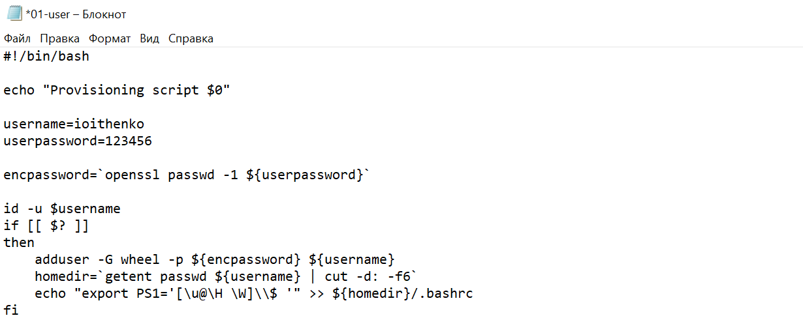
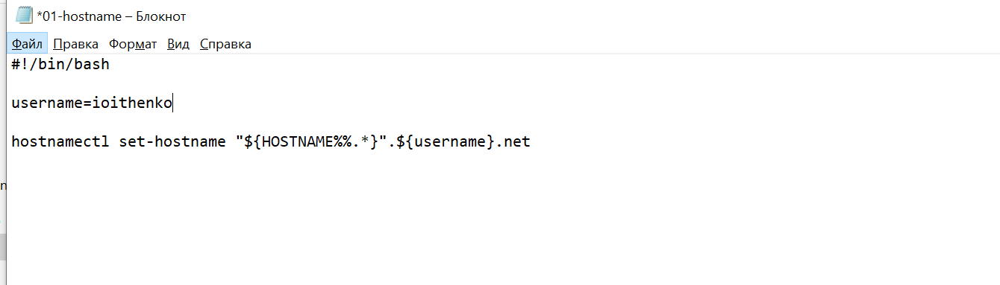
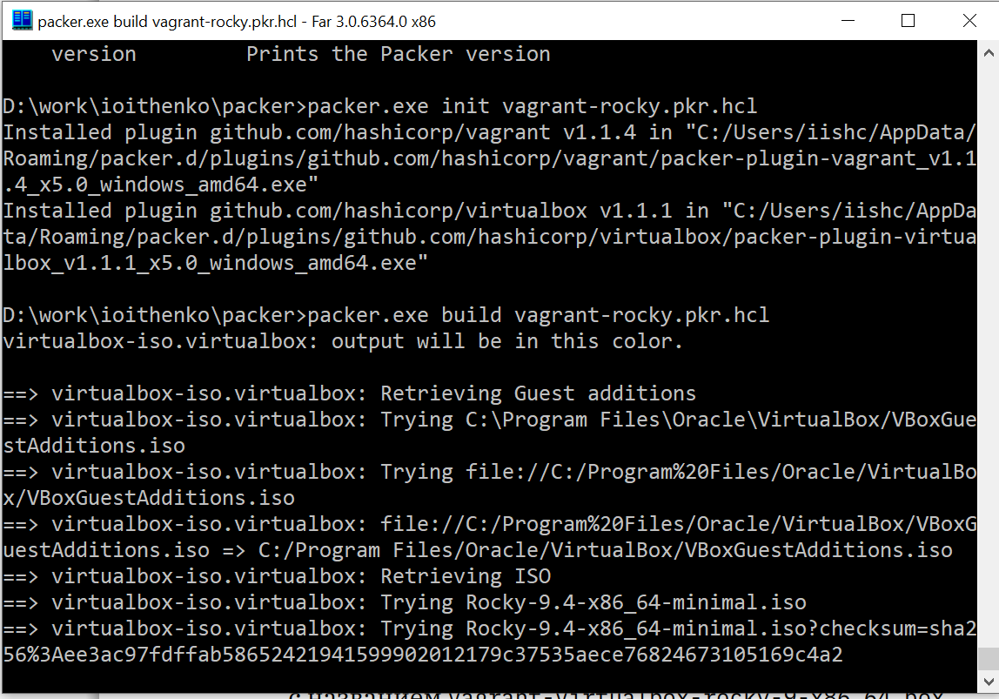

---
## Front matter
title: "Отчёт по лабораторной работе №1"
subtitle: "Администрирование сетевых подсистем"
author: "Ищенко Ирина Олеговна"

## Generic otions
lang: ru-RU
toc-title: "Содержание"

## Bibliography
bibliography: bib/cite.bib
csl: pandoc/csl/gost-r-7-0-5-2008-numeric.csl

## Pdf output format
toc: true # Table of contents
toc-depth: 2
lof: true # List of figures
lot: true # List of tables
fontsize: 12pt
linestretch: 1.5
papersize: a4
documentclass: scrreprt
## I18n polyglossia
polyglossia-lang:
  name: russian
  options:
	- spelling=modern
	- babelshorthands=true
polyglossia-otherlangs:
  name: english
## I18n babel
babel-lang: russian
babel-otherlangs: english
## Fonts
mainfont: PT Serif
romanfont: PT Serif
sansfont: PT Sans
monofont: PT Mono
mainfontoptions: Ligatures=TeX
romanfontoptions: Ligatures=TeX
sansfontoptions: Ligatures=TeX,Scale=MatchLowercase
monofontoptions: Scale=MatchLowercase,Scale=0.9
## Biblatex
biblatex: true
biblio-style: "gost-numeric"
biblatexoptions:
  - parentracker=true
  - backend=biber
  - hyperref=auto
  - language=auto
  - autolang=other*
  - citestyle=gost-numeric
## Pandoc-crossref LaTeX customization
figureTitle: "Рис."
tableTitle: "Таблица"
listingTitle: "Листинг"
lofTitle: "Список иллюстраций"
lotTitle: "Список таблиц"
lolTitle: "Листинги"
## Misc options
indent: true
header-includes:
  - \usepackage{indentfirst}
  - \usepackage{float} # keep figures where there are in the text
  - \floatplacement{figure}{H} # keep figures where there are in the text
---

# Цель работы

Целью данной работы является приобретение практических навыков установки
Rocky Linux на виртуальную машину с помощью инструмента Vagrant.

# Выполнение лабораторной работы

Для лабораторной работы предварительно были установлены последние версиии Vagrant и VirtualBox. Так как я работала в ОС Windows дополнительно установила Packer и FAR.

В директориях D:/work/ioithenko/packer и D:/ioithenko/vagrant предварительно разметила необходимые конфигурационные файлы, при этом внесла изменение в имя пользователя в файлах 01-user.sh (рис. [-@fig:001]) и 01-hostname.sh (рис. [-@fig:002]).

{#fig:001 width=70%}

{#fig:002 width=70%}

Далее приступили к развертыванию лабораторного стенда. Используя FAR, перешли в рабочий каталог с проектом D:/work/ioithenko/packer. Разместили в нем файл packer.exe. Вввели команды для начала автоматической установки образа операционной системы Rocky Linux
в VirtualBox и последующего формирования box-файла с дистрибутивом Rocky Linux
для VirtualBox (рис. [-@fig:003]).

{#fig:003 width=70%} 

По окончании процесса в рабочем каталоге сформировался box-файл
с названием vagrant-virtualbox-rocky-9-x86_64.box (рис. [-@fig:004]).

{#fig:004 width=70%} 

Для регистрации образа виртуальной машины в vagrant в командной строке ввели
vagrant box add rocky9 vagrant-virtualbox-rocky-9-x86_64.box
Для запуска виртуальной машины Server ввели в консоли
vagrant up server
(рис. [-@fig:005]).

{#fig:005 width=70%} 

Залогинились под пользователем vagrant с паролем vagrant в графическом окружении (рис. [-@fig:006]).

{#fig:006 width=70%} 

Для запуска виртуальной машины Client повторили действия (рис. [-@fig:007]).

{#fig:007 width=70%} 

Подключились к серверу из консоли:
vagrant ssh server
Ввели пароль vagrant. Перешли к пользователю ioithenko:
su - ioithenko
Пользователь не был найден.
Отлогинились (рис. [-@fig:008]).

{#fig:008 width=70%} 

Выполните тоже самое для клиента. Пользователь также не был найден. 
Выключили обе виртуальные машины:
vagrant halt server
vagrant halt client
(рис. [-@fig:009]).

{#fig:009 width=70%} 

Для отработки созданных скриптов во время загрузки виртуальных машин убедились, что в конфигурационном файле Vagrantfile до строк с конфигурацией сервера имеется запись (рис. [-@fig:0010]):

{#fig:0010 width=70%} 

Зафиксируем внесённые изменения для внутренних настроек виртуальных машин, введя в терминале
vagrant up server --provision
vagrant up client --provision
(рис. [-@fig:0011]) и (рис. [-@fig:0012]).

{#fig:0011 width=70%} 

{#fig:0012 width=70%} 

Залогинились на сервере и клиенте под созданным пользователем (рис. [-@fig:0013]) и (рис. [-@fig:0014]).

{#fig:0013 width=70%} 

{#fig:0014 width=70%}

Убедимся, что в терминале приглашение отображается в виде ioithenko@server.ioithenko.net (рис. [-@fig:0015]) на сервере и в виде ioithenko@client.ioithenko.net (рис. [-@fig:0016]) на клиенте.

{#fig:0015 width=70%} 

{#fig:0016 width=70%}

Выключим виртуальные машины. Скопируем необходимые для работы с Vagrant файлы и box-файлы виртуальных машин в другой каталог ОС.

# Выводы

В ходе лабораторной работы я приобрела практические навыки установки
Rocky Linux на виртуальную машину с помощью инструмента Vagrant.

# Контрольные вопросы

1. Для чего предназначен Vagrant?

Vagrant — это инструмент, который позволяет создавать и управлять виртуальными машинами в рамках одного рабочего процесса. Он автоматизирует как установку основного дистрибутива операционной системы на ВМ, так и последующую настройку необходимого программного обеспечения.

2. Что такое box-файл? В чём назначение Vagrantfile? 

box-файл — сохранённый образ виртуальной машины с развёрнутой в ней операционной системой, box-файл используется как основа для клонирования виртуальных машин с теми или иными настройками.

Vagrantfile — конфигурационный файл, написанный
на языке Ruby, в котором указаны настройки запуска виртуальной машины.

3. Приведите описание и примеры вызова основных команд Vagrant.

vagrant help — вызов справки по командам Vagrant;
vagrant box list — список подключённых к Vagrant box-файлов;
vagrant box add — подключение box-файла к Vagrant;
vagrant destroy— отключение box-файла от Vagrant и удаление его из
виртуального окружения;
vagrant init — создание «шаблонного» конфигурационного файла
Vagrantfile для его последующего изменения;
vagrant up — запуск виртуальной машины с использованием инструкций
по запуску из конфигурационного файла Vagrantfile;
vagrant reload — перезагрузка виртуальной машины;
vagrant halt — остановка и выключение виртуальной машины;
vagrant provision — настройка внутреннего окружения имеющейся виртуальной машины;
vagrant ssh — подключение к виртуальной машине через ssh.

4. Дайте построчные пояснения содержания файлов vagrant-rocky.pkr.hcl, ks.cfg, Vagrantfile, Makefile.

vagrant-rocky.pkr.hcl — файл конфигурации для Packer — инструмента, который используется для автоматизации создания образов виртуальных машин. Сначала указываются необходимые плагины для работы: Vagrant и VirtualBox.
Задают параметры, такие как описание артефакта, версия, размер диска, контрольная сумма ISO-образа и URL для загрузки ISO. Значения по умолчанию могут быть изменены при запуске Packer.
Далее определяется источник виртуальной машины, которая будет создана с использованием ISO-образа. Здесь указываются команды для загрузки, настройки диска, параметры SSH и другие настройки.
Определяется процесс сборки, включающий в себя:
- Provisioner: Используется для выполнения команд на созданной виртуальной машине (например, установка программного обеспечения).
- Post-processor: Создает Vagrant box из полученного образа виртуальной машины.

Vagrantfile - Первые две строки указывают на режим работы с Vagrantfile и использование языка Ruby. Затем идёт цикл do, заменяющий конструкцию Vagrant.configure далее по тексту на config. Строка config.vm.box = "BOX_NAME" задаёт название образа (box-файла) виртуальной машины (обычно выбирается из официального репозитория).
Строка config.vm.hostname = "HOST_NAME" задаёт имя виртуальной машины. Конструкция config.vm.network задаёт тип сетевого соединения
и может иметь следующие назначения:

- config.vm.network "private_network", ip: "xxx.xxx.xxx.xxx" — адрес из внутренней сети; 
- config.vm.network "public_network", ip: "xxx.xxx.xxx.xxx" — публичный адрес,
по которому виртуальная машина будет доступна;
- config.vm.network "private_network", type: "dhcp" — адрес, назначаемый по протоколу DHCP.

Строка config.vm.define "VM_NAME" задаёт название виртуальной машины, по которому можно обращаться к ней из Vagrant и VirtualBox. В конце идёт конструкция, определяющая параметры провайдера, а именно запуск виртуальной машины без графического интерфейса и с выделением 1 ГБ памяти.

