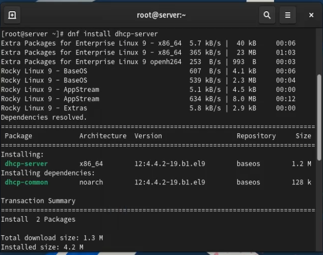
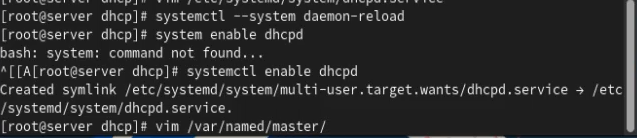
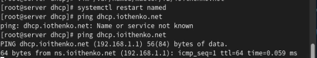
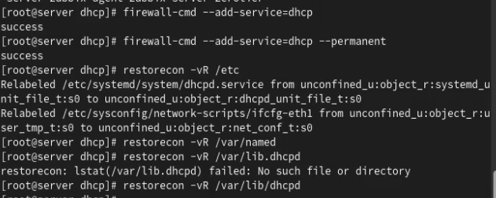
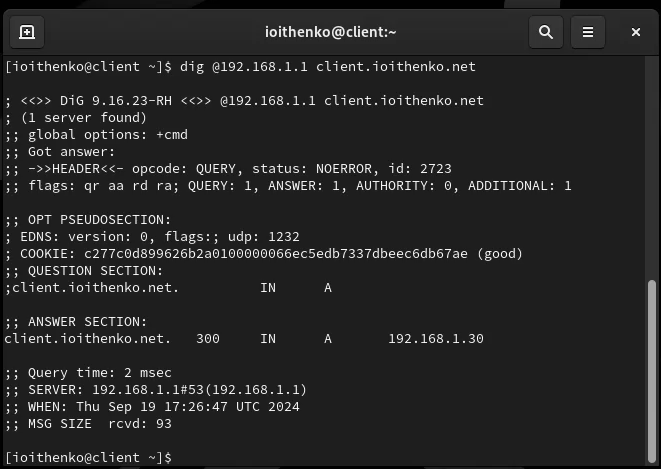
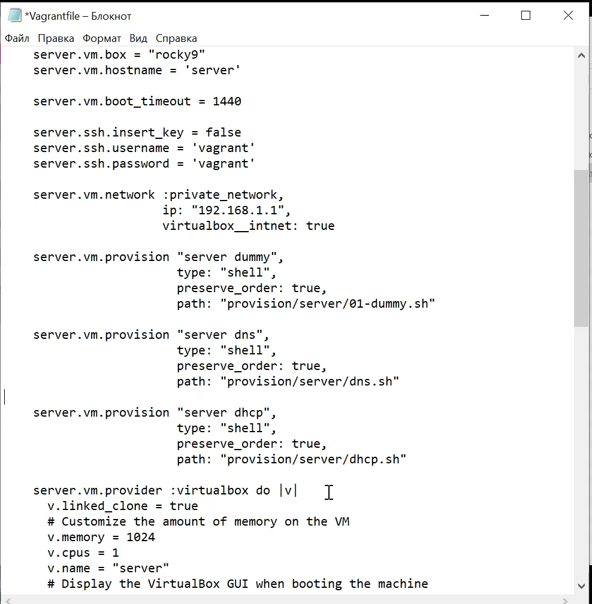

---
## Front matter
lang: ru-RU
title: Лабораторная работа №3
subtitle: Администрирование сетевых подсистем
author:
  - Ищенко Ирина НПИбд-02-22
institute:
  - Российский университет дружбы народов, Москва, Россия

## i18n babel
babel-lang: russian
babel-otherlangs: english

## Formatting pdf
toc: false
toc-title: Содержание
slide_level: 2
aspectratio: 169
section-titles: true
theme: metropolis
header-includes:
 - \metroset{progressbar=frametitle,sectionpage=progressbar,numbering=fraction}
---

## Цель работы

Приобретение практических навыков по установке и конфигурированию DHCP-сервера.

# Выполнение лабораторной работы

##

{#fig:1 width=70%}

##

{#fig:2 width=70%}

##

{#fig:3 width=50%}

##

{#fig:4 width=70%}

##

{#fig:5 width=50%}

##

{#fig:6 width=70%}

##

{#fig:7 width=50%}

##

{#fig:8 width=50%}

##

{#fig:9 width=60%}

##

{#fig:10 width=60%}

##

{#fig:11 width=70%}

##

{#fig:12 width=70%}

##

{#fig:13 width=50%}

##

{#fig:14 width=50%}

##

{#fig:15 width=70%}

##

{#fig:16 width=50%}

##

{#fig:17 width=50%}

##

{#fig:18 width=50%}

##

{#fig:19 width=50%}

##

{#fig:20 width=70%}

##

{#fig:21 width=50%}

##

{#fig:22 width=70%}

##

{#fig:23 width=50%}

##

{#fig:24 width=50%}

## Выводы

В результате выполнения работы я приобрела практические навыки по установке и конфигурированию DHCP-сервера.