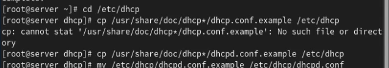
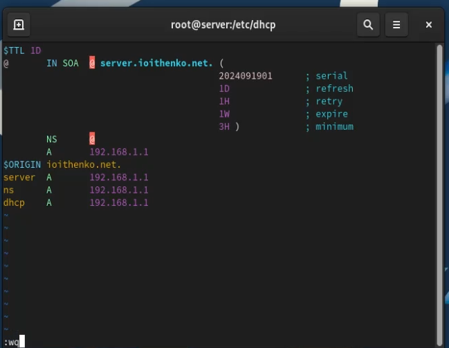
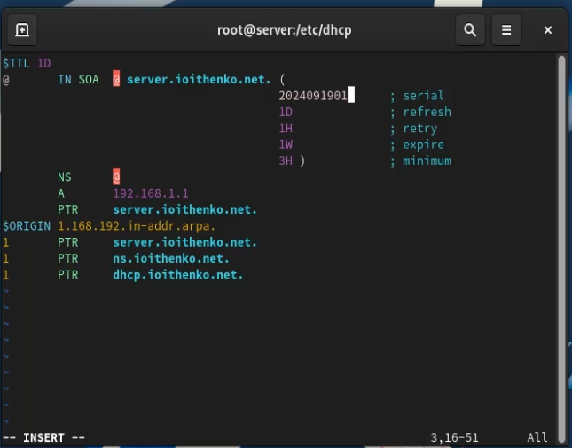
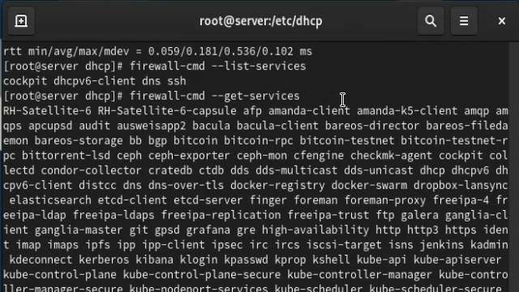
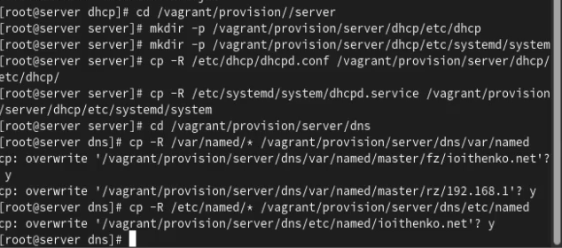

---
## Front matter
title: "Отчёт по лабораторной работе №3"
subtitle: "Администрирование сетевых систем"
author: "Ищенко Ирина НПИбд-02-22"

## Generic otions
lang: ru-RU
toc-title: "Содержание"

## Bibliography
bibliography: bib/cite.bib
csl: pandoc/csl/gost-r-7-0-5-2008-numeric.csl

## Pdf output format
toc: true # Table of contents
toc-depth: 2
lof: true # List of figures
lot: true # List of tables
fontsize: 12pt
linestretch: 1.5
papersize: a4
documentclass: scrreprt
## I18n polyglossia
polyglossia-lang:
  name: russian
  options:
	- spelling=modern
	- babelshorthands=true
polyglossia-otherlangs:
  name: english
## I18n babel
babel-lang: russian
babel-otherlangs: english
## Fonts
mainfont: IBM Plex Serif
romanfont: IBM Plex Serif
sansfont: IBM Plex Sans
monofont: IBM Plex Mono
mathfont: STIX Two Math
mainfontoptions: Ligatures=Common,Ligatures=TeX,Scale=0.94
romanfontoptions: Ligatures=Common,Ligatures=TeX,Scale=0.94
sansfontoptions: Ligatures=Common,Ligatures=TeX,Scale=MatchLowercase,Scale=0.94
monofontoptions: Scale=MatchLowercase,Scale=0.94,FakeStretch=0.9
mathfontoptions:
## Biblatex
biblatex: true
biblio-style: "gost-numeric"
biblatexoptions:
  - parentracker=true
  - backend=biber
  - hyperref=auto
  - language=auto
  - autolang=other*
  - citestyle=gost-numeric
## Pandoc-crossref LaTeX customization
figureTitle: "Рис."
tableTitle: "Таблица"
listingTitle: "Листинг"
lofTitle: "Список иллюстраций"
lotTitle: "Список таблиц"
lolTitle: "Листинги"
## Misc options
indent: true
header-includes:
  - \usepackage{indentfirst}
  - \usepackage{float} # keep figures where there are in the text
  - \floatplacement{figure}{H} # keep figures where there are in the text
---

# Цель работы

Приобретение практических навыков по установке и конфигурированию DHCP-сервера.

# Выполнение лабораторной работы

Запускаем ВМ через рабочий каталог. На ВМ `server` входим под моим пользователем и переходим в режим суперпользователя. Устанавливаем `dhcp`(рис. [-@fig:1]).

{#fig:1 width=70%}

Копируем файл примера конфигурации DHCP `dhcpd.conf.example` из каталога
/`usr/share/doc/dhcp*` в каталог `/etc/dhcp` и переименовываем его в файл с названием
`dhcpd.conf` (рис. [-@fig:2]).

{#fig:2 width=70%}

Редактируем файл `/etc/dhcp/dhcpd.conf` (рис. [-@fig:3])

{#fig:3 width=70%}

Настраиваем привязку `dhcpd` к интерфейсу `eth1` виртуальной машины `server`. Вводим (рис. [-@fig:4]):

cp /lib/systemd/system/dhcpd.service /etc/systemd/system/

{#fig:4 width=70%}

и редактируем файл ` /etc/systemd/system/dhcpd.service` (рис. [-@fig:5])

{#fig:5 width=70%}

Перезагружаем конфигурацию `dhcpd` и разрешаем загрузку DHCP-сервера при запуске виртуальной машины `server` (рис. [-@fig:6])

{#fig:6 width=70%}

Добавляем запись для DHCP-сервера в конце файла прямой DNS-зоны (рис. [-@fig:7]) и в конце файла обратной зоны (рис. [-@fig:8]).

{#fig:7 width=70%}

{#fig:8 width=70%}

Перезапускаем `named` и обращаемся к DHCP-серверу по имени (рис. [-@fig:9]). 

{#fig:9 width=70%}

Вносим изменения в настройки межсетевого экрана узла `server`, разрешив работу с DHCP. Восстанавливаем контекст безопасности SELinux (рис. [-@fig:10]), (рис. [-@fig:11])

{#fig:10 width=70%}

{#fig:11 width=70%}

В дополнительном терминале запускаем мониторинг происходящих в системе процессов в реальном времени.

В основном терминале запускаем DHCP-сервер (рис. [-@fig:12])

{#fig:12 width=70%}

Проверяем файл `01-routing.sh` в подкаталоге `vagrant/provision/client` (рис. [-@fig:13]). В Vagrantfile проверяем, что скрипт подключен (рис. [-@fig:14]).

{#fig:13 width=70%}

{#fig:14 width=70%}

Включаем ВМ `client`. На `server` вижу запись о подключении к ВМ узла `client` и выдачи ему
IP-адреса из соответствующего диапазона адресов (рис. [-@fig:15]).

{#fig:15 width=70%}

Также просматриваем файл ` /var/lib/dhcpd/dhcpd.leases` (рис. [-@fig:16])

{#fig:16 width=70%}

Содержание файла:

1 author ing-byte-order Little-endian;
   - Указывает порядок байтов для записи данных. "Little-endian" означает, что младший байт хранится первым.

2. server-duid "\000\001\000\001.\177\017\271\010\000"\341\222\255";
   - Это уникальный идентификатор сервера (DUID), используемый для идентификации DHCP-сервера. Он представлен в виде строки байтов.

3. lease 192.168.1.30 {
   - Начало блока аренды IP-адреса 192.168.1.30, который будет предоставлен клиенту.

4. starts 4 2024/09/19 16:42:22;
   - Указывает время начала аренды (дата и время).

5. ends 4 2024/09/19 16:52:22;
   - Указывает время окончания аренды.

6. cltt 4 2024/09/19 16:42:
   - Время последнего запроса аренды (Client Last Transaction Time).

7. binding state active;
    - Указывает, что текущее состояние привязки IP-адреса активно.

8. next binding state free;
    - Указывает, что следующее состояние привязки будет свободным, когда аренда истечет.

9. rewind binding state free;
    - Указывает на состояние возврата привязки, которое также свободно.

10. hardware ethernet 08:00:27:8d:1f:f7;
    - Указывает аппаратный адрес (MAC-адрес) клиента, которому предоставлен этот IP-адрес.

11. uid "\001\010\000'\215\637\367";
    - Уникальный идентификатор клиента (UID), который может использоваться для идентификации устройства.

12. client-hostname "client";
    - Имя хоста клиента, который запрашивает аренду IP-адреса.

На ВМ `client` вводим `ifconfig` и просматриваем имеющиеся интерфейсы  (рис. [-@fig:17])

{#fig:17 width=70%}

Содержимое ifconfig:

eth0:

1. eth0: flags=4163<UP BROADCAST, RUNNING, MULTICAST> mtu 1500
   - Интерфейс eth0 активен (UP), поддерживает широковещательную рассылку (BROADCAST), работает (RUNNING) и поддерживает многокаст (MULTICAST). MTU (Maximum Transmission Unit) равен 1500 байтам.

2. inet 10.0.2.15 netmask 255.255.255.0 broadcast 10.0.2.255
   - IPv4-адрес интерфейса: 10.0.2.15. Маска подсети: 255.255.255.0, что означает, что сеть имеет 256 адресов. Широковещательный адрес сети: 10.0.2.255.

3. inet6 fe80::a00:27ff:feed:fbde prefixlen 64 scopeid 0x20<Link>
   - IPv6-адрес: fe80::a00:27ff:feed:fbde. Префикс длиной 64 бита, область действия — локальная сеть.

4. ether 68:00:27:e0:fb:de txqueuelen 1000 (Ethernet)
   - MAC-адрес интерфейса: 68:00:27:e0:fb:de. Длина очереди передачи (txqueuelen) составляет 1000 пакетов.

5. RX packets 957 bytes 107344 (104.8 KiB)
   - Получено 957 пакетов, общий объем данных — 107344 байта (104.8 KiB).

6. RX errors 0 dropped 0 overruns 6 frame 6
   - Ошибки при получении: 0 потерянных пакетов, 0 переполнений, 6 ошибок фрейма.

7. TX packets 843 bytes 128819 (125.7 KiB)
   - Отправлено 843 пакета, общий объем данных — 128819 байт (125.7 KiB).

8. TX errors 0 dropped 0 overruns 0 carrier 0 collisions 0
   - Ошибки при передаче: 0 потерянных пакетов, 0 переполнений, 0 ошибок связи, 0 коллизий.

eth1:

1. eth1: flags=4163<UP BROADCAST, RUNNING, MULTICAST> mtu 1500
   - Интерфейс eth1 также активен и имеет те же характеристики, что и eth0.

2. inet 192.168.1.30 netmask 255.255.255.0 broadcast 192.168.1.255
   - IPv4-адрес интерфейса: 192.168.1.30. Маска подсети и широковещательный адрес аналогичны.

3. inet6 fe80::a00:27ff:fe8d:1ff7 prefixlen 64 scopeid 0x20<Link>
   - IPv6-адрес: fe80::a00:27ff:fe8d:1ff7, префикс длиной 64 бита, область действия — локальная сеть.

4. ether 08:00:27:8d:1f:f7 txqueuelen 1900 (Ethernet)
   - MAC-адрес интерфейса: 08:00:27:8d:1f:f7. Длина очереди передачи составляет 1900 пакетов.

5. RX packets 69 bytes 8974 (8.7 KiB)
   - Получено 69 пакетов, общий объем данных — 8974 байта (8.7 KiB).

6. RX errors 0 dropped 0 overruns 0 frame 0
   - Ошибки при получении: нет потерянных пакетов, переполнений или ошибок фрейма.

7. TX packets 315 bytes 32852 (32.0 KiB)
   - Отправлено 315 пакетов, общий объем данных — 32852 байта (32 KiB).

8. TX errors 0 dropped 0 overruns 0 carrier 0 collisions 0
   - Ошибки при передаче: нет потерянных пакетов, переполнений, ошибок связи или коллизий.

lo (Loopback):

1. lo: flags=73<UP, LOOPBACK, RUNNING> mtu 65536
   - Интерфейс lo (loopback) активен и работает с MTU равным 65536 байтам.

2. inet 127.0.0.1 netmask 255.0.0.0
   - IPv4-адрес интерфейса loopback: 127.0.0.1, маска подсети — 255.0.0.0.

3. inet6 ::1 prefixlen 128 scopeid 0x10<host>
   - IPv6-адрес loopback: ::1, префикс длиной 128 бит, область действия — локальный хост.

4. loop txqueuelen 1009 (Local Loopback)
   - Длина очереди передачи для интерфейса loopback составляет 1009 пакетов.

5. RX packets 18 bytes 2101 (2.0 KiB)
   - Получено 18 пакетов, общий объем данных — 2101 байт (2 KiB).

Редактируем файл `/etc/named/ioithenko.net` (рис. [-@fig:18]).

{#fig:18 width=70%}

Перезапускаем DNS-сервер. Редактируем файл `/etc/dhcp/dhcpd.conf` (рис. [-@fig:19]).

{#fig:19 width=70%}

Перезапускаtv DHCP-сервер. В каталоге прямой DNS-зоны появился файл `ioithenko.net.jnl` (рис. [-@fig:20]).

{#fig:20 width=70%}

На виртуальной машине `client` открываем терминал и с помощью утилиты `dig` убеждаемся в наличии DNS-записи о клиенте в прямой DNS-зоне (рис. [-@fig:21]).

{#fig:21 width=70%}

Давайте разберем вывод команды dig построчно.

1. 3 <<>> DIG 9.16.23-RH <<>> @192.168.1.1 client.ioithenko.net
- DIG 9.16.23-RH: Это версия утилиты dig, используемой для выполнения DNS-запросов.
- @192.168.1.1: Запрос отправляется на DNS-сервер с IP-адресом 192.168.1.1.
- client.ioithenko.net: Это доменное имя, для которого выполняется запрос.

2. (1 server found)
- Указывает, что был найден один сервер для обработки запроса.

3. 33 global options:
- Это строка может указывать на глобальные параметры, используемые в запросе, но конкретные опции не указаны.

4. 33 Got answer:
- Указывает, что сервер вернул ответ на запрос.

5. 3} ~>>HEADER<<- opcode: QUERY, status: NOERROR, id: 2723
- opcode: QUERY: Тип операции — это стандартный запрос.
- status: NOERROR: Статус ответа — нет ошибок, запрос выполнен успешно.
- id: 2723: Идентификатор запроса, который может быть использован для сопоставления запросов и ответов.

6. 33 flags: qr aa rd ra; QUERY: 1, ANSWER: 1, AUTHORITY: ©, ADDITIONAL: 1
- flags:
  - qr: Указывает, что это ответ (query response).
  - aa: Сервер является авторитетным для данного ответа.
  - rd: Запрос был сделан с рекурсией (recursive).
  - ra: Сервер поддерживает рекурсию.
- QUERY: 1: В запросе была одна запись.
- ANSWER: 1: В ответе содержится одна запись.
- AUTHORITY: 0: Указано количество авторитетных записей.
- ADDITIONAL: 1: В ответе также есть одна дополнительная запись.

7. 53 OPT PSEUDOSECTION!3 EDNS: version: 0, flags:; udp: 1232
- OPT PSEUDOSECTION: Раздел для расширенных DNS (EDNS).
- version: 0: Версия EDNS.
- flags:: Здесь нет дополнительных флагов.
- udp: 1232: Максимальный размер UDP-пакета для ответа — 1232 байта.

8. 3 COOKIE: c277c0d899626b2a0100000066ecSedb7337dbeecédb6Tae (good)
- Это cookie, используемое для идентификации сессии DNS. Указание на то, что cookie "good" может означать его корректность или успешность.

9. 33 QUESTION SECTION:
- Начало секции вопросов.

10. 3client.ioithenko.net. IN A
- Запрос на получение записи типа A (IPv4-адрес) для домена client.ioithenko.net.

11. 53 ANSWER SECTION: client.ioithenko.net. 300 IN A 192.168.1.30
- Ответ на запрос:
  - Доменное имя: client.ioithenko.net.
  - Время жизни (TTL): 300 секунд.
  - Запись типа A с адресом 192.168.1.30.

12. 33 Query time: 2 msec
- Время, затраченное на выполнение запроса — 2 миллисекунды.

13. 3} SERVER: 192.168.1.1#53(192.168.1.13}
- Указывает на сервер, который обработал запрос (192.168.1.1) и его порт (53). Второй адрес (192.168.1.13) может указывать на другой адрес сервера или клиента.
- 
14. 33 MSG SIZE revd: 93
- Размер полученного сообщения — 93 байта.

На ВМ `server` переходим в каталог для внесения изменений в настройки внутреннего окружения `/vagrant/provision/server/`, создаем в нём каталог `dhcp`, в который помещаю в соответствующие подкаталоги конфигурационные файлы DHCP:

Заменяем конфигурационные файлы DNS-сервера(рис. [-@fig:22]).

{#fig:22 width=70%}

В каталоге `/vagrant/provision/server` создаем исполняемый файл `dhcp.sh` (рис. [-@fig:23]).

{#fig:23 width=70%}

Для отработки скрипта во время запуска добавляю в Vagrantfile в разделе конфигурации для сервера (рис. [-@fig:24]).

{#fig:24 width=70%}

После этого выключаю ВМ:

vagrant halt client

vagrant halt server

# Выводы

В результате выполнения работы я приобрела практические навыки по установке и конфигурированию DHCP-сервера.

# Ответы на контрольные вопросы

1. В каких файлах хранятся настройки сетевых подключений? 

В Linux настройки сети обычно хранятся в текстовых файлах в
директории `/etc/network/` или `/etc/sysconfig/network-scripts/`.

2. За что отвечает протокол DHCP? 

Протокол DHCP (Dynamic Host Configuration Protocol) отвечает за автоматическое присвоение
сетевых настроек устройствам в сети, таких как IP-адресов,
маски подсети, шлюза, DNS-серверов и других параметров.

3. Поясните принцип работы протокола DHCP. Какими сообщениями обмениваются клиент и сервер, используя протокол DHCP? 

Принцип работы протокола DHCP:

Discover (Обнаружение): Клиент отправляет в сеть запрос на
обнаружение DHCP-сервера.

Offer (Предложение): DHCP-сервер отвечает клиенту, предлагая
ему конфигурацию сети.

Request (Запрос): Клиент принимает предложение и отправляет
запрос на использование предложенной конфигурации.

Acknowledgment (Подтверждение): DHCP-сервер подтверждает
клиенту, что предложенная конфигурация принята и может быть
использована.

4. В каких файлах обычно находятся настройки DHCP-сервера? За что
отвечает каждый из файлов? 

Настройки DHCP-сервера обычно хранятся в файлах конфигурации, таких как `/etc/dhcp/dhcpd.conf`. Они содержат информацию о диапазонах IP-адресов, параметрах сети и других опциях DHCP.

5. Что такое DDNS? Для чего применяется DDNS? 

DDNS (Dynamic Domain Name System) - это система динамического доменного
имени. Она используется для автоматического обновления записей DNS, когда IP-адрес узла изменяется. DDNS применяется, например, в домашних сетях, где IP-адреса часто изменяются
посредством DHCP.

6. Какую информацию можно получить, используя утилиту ifconfig? Приведите примеры с использованием различных опций. 

Утилита `ifconfig` используется для получения информации о сетевых
интерфейсах.

Примеры:

`ifconfig`: Показывает информацию обо всех активных сетевых
интерфейсах.

`ifconfig eth0`: Показывает информацию о конкретном интерфейсе
(в данном случае, eth0).

7. Какую информацию можно получить, используя утилиту ping? Приведите примеры с использованием различных опций.

Утилита `ping` используется для проверки доступности узла в сети.

Примеры:

`ping yandex.ru`: Пингует домен yandex.ru.

`ping -c 4 192.168.1.1`: Пингует IP-адрес 192.168.1.1 и отправляет 4
эхо-запроса.

