---
## Front matter
title: "Отчёт по лабораторной работе №4"
subtitle: "Администрирование сетевых подсистем"
author: "Ищенко Ирина НПИбд-02-22"

## Generic otions
lang: ru-RU
toc-title: "Содержание"

## Bibliography
bibliography: bib/cite.bib
csl: pandoc/csl/gost-r-7-0-5-2008-numeric.csl

## Pdf output format
toc: true # Table of contents
toc-depth: 2
lof: true # List of figures
lot: true # List of tables
fontsize: 12pt
linestretch: 1.5
papersize: a4
documentclass: scrreprt
## I18n polyglossia
polyglossia-lang:
  name: russian
  options:
	- spelling=modern
	- babelshorthands=true
polyglossia-otherlangs:
  name: english
## I18n babel
babel-lang: russian
babel-otherlangs: english
## Fonts
mainfont: IBM Plex Serif
romanfont: IBM Plex Serif
sansfont: IBM Plex Sans
monofont: IBM Plex Mono
mathfont: STIX Two Math
mainfontoptions: Ligatures=Common,Ligatures=TeX,Scale=0.94
romanfontoptions: Ligatures=Common,Ligatures=TeX,Scale=0.94
sansfontoptions: Ligatures=Common,Ligatures=TeX,Scale=MatchLowercase,Scale=0.94
monofontoptions: Scale=MatchLowercase,Scale=0.94,FakeStretch=0.9
mathfontoptions:
## Biblatex
biblatex: true
biblio-style: "gost-numeric"
biblatexoptions:
  - parentracker=true
  - backend=biber
  - hyperref=auto
  - language=auto
  - autolang=other*
  - citestyle=gost-numeric
## Pandoc-crossref LaTeX customization
figureTitle: "Рис."
tableTitle: "Таблица"
listingTitle: "Листинг"
lofTitle: "Список иллюстраций"
lotTitle: "Список таблиц"
lolTitle: "Листинги"
## Misc options
indent: true
header-includes:
  - \usepackage{indentfirst}
  - \usepackage{float} # keep figures where there are in the text
  - \floatplacement{figure}{H} # keep figures where there are in the text
---

# Цель работы

Приобретение практических навыков по установке и базовому конфигурированию
HTTP-сервера Apache.

# Выполнение лабораторной работы

Запускаем ВМ через рабочий каталог. На ВМ `server` входим под собственным пользователем и переходим в режим суперпользователя. Устанавливаем стандартный веб-сервер (рис. [-@fig:1]) и (рис. [-@fig:2]).

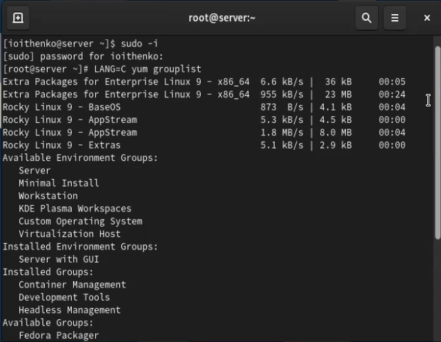{#fig:1 width=70%}

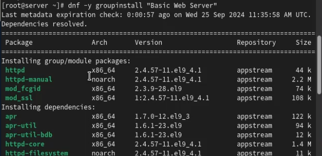{#fig:2 width=70%}

Просматриваем содержание конфигурационных файлов в каталогах `/etc/httpd/conf` и `/etc/httpd/conf.d` (рис. [-@fig:3]) и (рис. [-@fig:4]).

{#fig:3 width=70%}

{#fig:4 width=70%}

Вносим изменения в настройки межсетевого экрана узла `server`, разрешив работу с http (рис. [-@fig:5]). Во втором терминале открываем расширенный лог системных сообщений. В первом терминале активируем и запускаем HTTP-сервер (рис. [-@fig:6]).

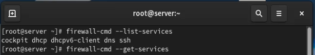{#fig:5 width=70%}

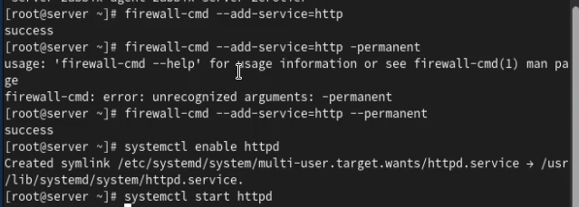{#fig:6 width=70%}

В логе системных сообщений вижу, что веб-сервер запущен (рис. [-@fig:7])

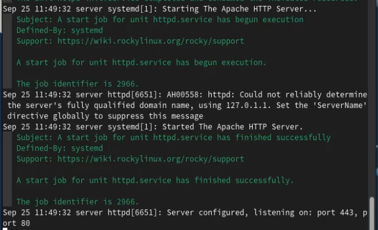{#fig:7 width=70%}

На виртуальной машине `server` открываем лог ошибок работы веб-сервера: `tail -f /var/log/httpd/error_log`; и мониторинг доступа к веб-серверу: `tail -f /var/log/httpd/access_log`.

Запускаем ВМ `client`, открываем браузер и в адресной строке вводим `192.168.1.1` (рис. [-@fig:8])

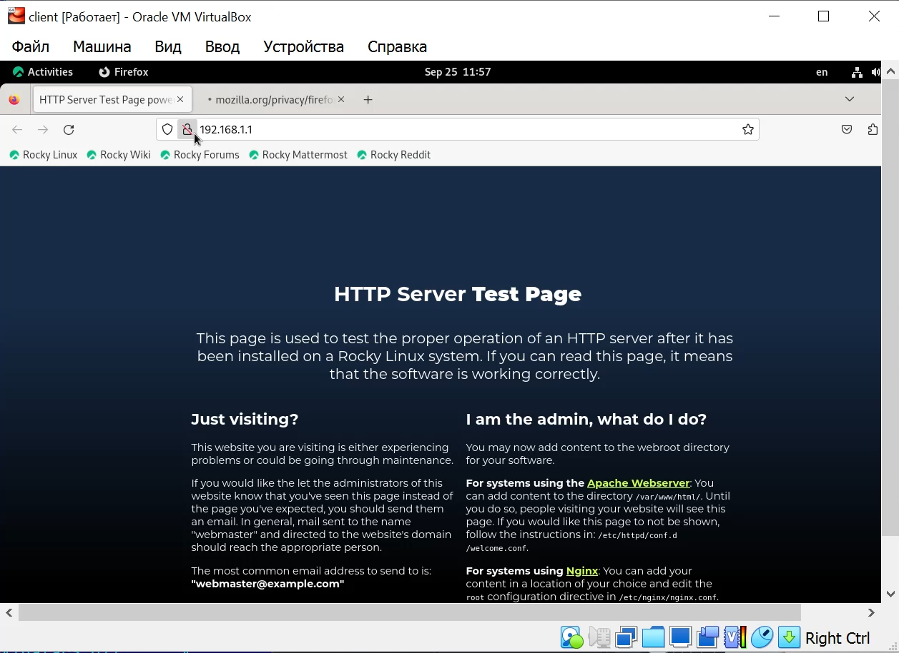{#fig:8 width=70%}

Видим записи в логе ошибок (рис. [-@fig:9]) и в мониторинге доступа о подключении к серверу (рис. [-@fig:10]).

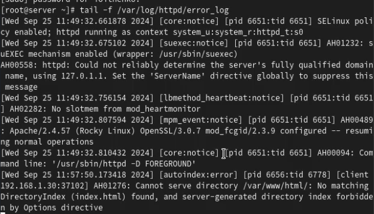{#fig:9 width=70%}

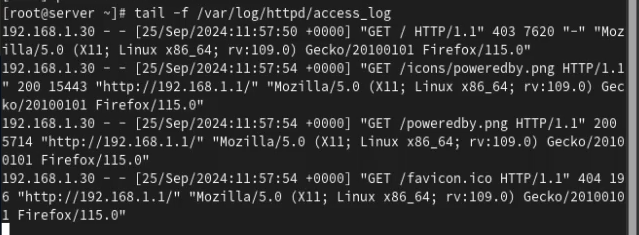{#fig:10 width=70%}

Останавливаем работу DNS-сервера. Добавляем запись для HTTP-сервера в конце файла прямой DNS-зоны (рис. [-@fig:11]). 

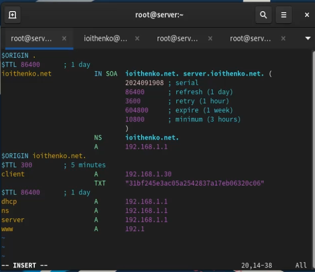{#fig:11 width=70%}

Добавляем также запись в конце файла обратной зоны (рис. [-@fig:12])

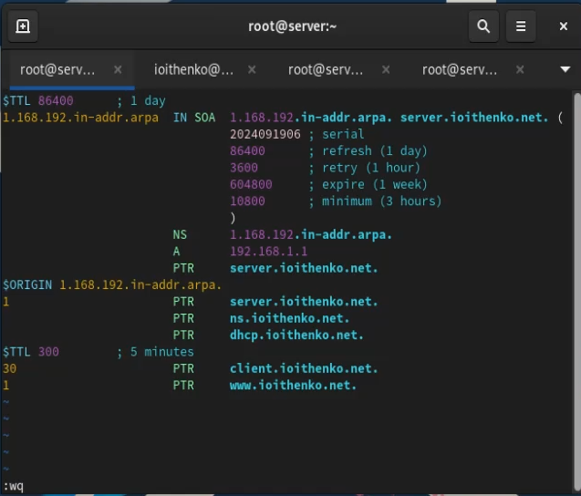{#fig:12 width=70%}

Удаляем из соответствующих каталогов файлы журналов DNS. Перезапускаем DNS-сервер. В каталоге `/etc/httpd/conf.d` создаю файлы `server.ioithenko.net.conf` и `www.ioithenko.net.conf` (рис. [-@fig:13]).

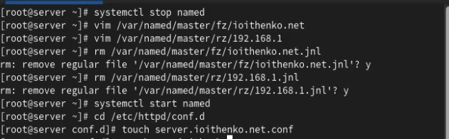{#fig:13 width=70%}

Редактируем `server.ioithenko.net.conf`  (рис. [-@fig:14]).

{#fig:14 width=70%}

Редактируем `www.ioithenko.net.conf`  (рис. [-@fig:15]).

{#fig:15 width=70%}

Переходим в `/var/www/html` создаем каталог `server.ioithenko.net` и в нем файл `index.html` (рис. [-@fig:16]). Вводим в файл сообщение Welcome to the server.ioithenko.net server. Аналогично создаем каталог и файл для `www.ioithenko.net`.

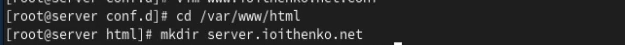{#fig:16 width=70%}

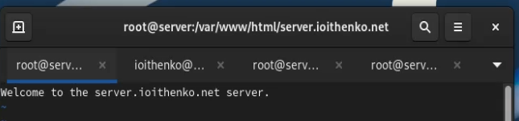{#fig:17 width=70%}

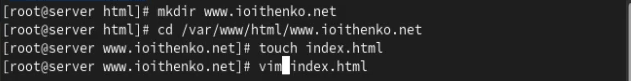{#fig:18 width=70%}

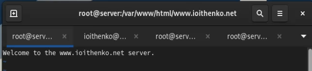{#fig:19 width=70%}

Корректируем права доступа в каталог с веб-контентом, восстанавливаем контекст безопасности в SELinux, перезагружаем HTTP-сервер (рис. [-@fig:20]) и (рис. [-@fig:21]).

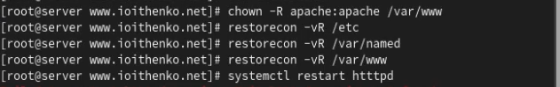{#fig:20 width=70%}

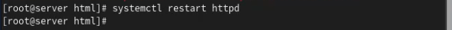{#fig:21 width=70%}

На ВМ `client` вводим в адресную строку браузера `server.ioithenko.net`  (рис. [-@fig:22]) и `www.ioithenko.net` (рис. [-@fig:23]).

{#fig:22 width=70%} 

{#fig:23 width=70%}

На ВМ `server` переходим в каталог для внесения изменений в настройки внутреннего окружения `/vagrant/provision/server/`, создаем в нём каталог `http`, в который помещаем в соответствующие подкаталоги конфигурационные файлы HTTP-сервера. Заменяем конфигурационные файлы DNS-сервера (рис. [-@fig:24]).

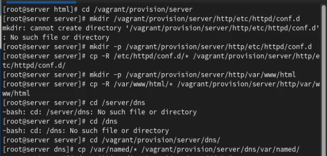{#fig:24 width=70%}

В каталоге `/vagrant/provision/server` создаем исполняемый файл `http.sh` (рис. [-@fig:25]).

{#fig:25 width=70%}

Для отработки скрипта во время запуска добавляем в Vagrantfile в разделе конфигурации для сервера  (рис. [-@fig:26]).

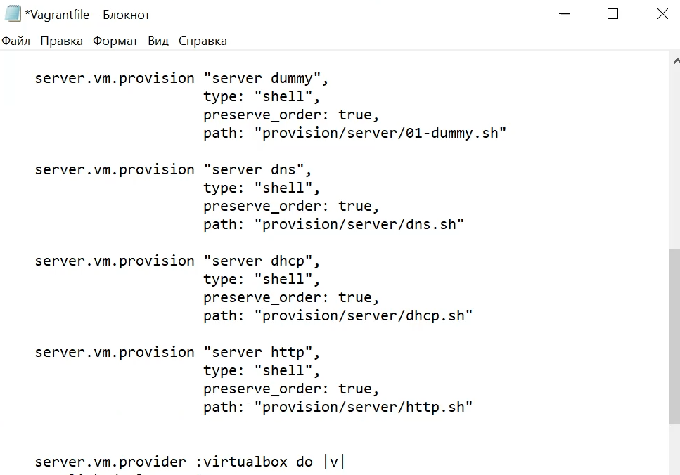{#fig:26 width=70%}

# Выводы

В ходе выполнения работы я приобрела практические навыки по установке и базовому конфигурированию HTTP-сервера Apache.

# Ответы на контрольные вопросы

1. Через какой порт по умолчанию работает Apache? 

По умолчанию Apache работает через порт 80 для HTTP и порт 443 для HTTPS.

2. Под каким пользователем запускается Apache и к какой группе относится этот пользователь?

Apache обычно запускается от имени пользователя www-data (или apache, в зависимости от дистрибутива)
и относится к группе с тем же именем.

3. Где располагаются лог-файлы веб-сервера? Что можно по ним отслеживать? 

Лог-файлы веб-сервера обычно располагаются в директории логов. Например, в /etc/httpd/logs/. Лог-файлы содержат информацию о запросах к серверу, ошибки, статусы запросов и другие события, что позволяет администраторам отслеживать активность и выявлять проблемы.

4. Где по умолчанию содержится контент веб-серверов? 

Контент веб-серверов по умолчанию обычно находится в директории, называемой
"DocumentRoot". Например, в Apache на Linux DocumentRoot по умолчанию установлен в `/var/www/html/`. В этой директории содержатся файлы, которые веб-сервер отдает при запросах.

5. Каким образом реализуется виртуальный хостинг? Что он даёт? 

Виртуальный хостинг в Apache позволяет хостить несколько сайтов на одном сервере. Разные сайты обслуживаются на одном IP-адресе, но на разных доменных именах. Это основывается на значении заголовка "Host" в HTTP-запросе, который используется для определения, какой виртуальный хост должен обработать запрос. Виртуальный хостинг позволяет хозяину сервера размещать несколько сайтов на одном физическом сервере, управлять ими независимо, и предоставлять услуги хостинга для различных клиентов или проектов.