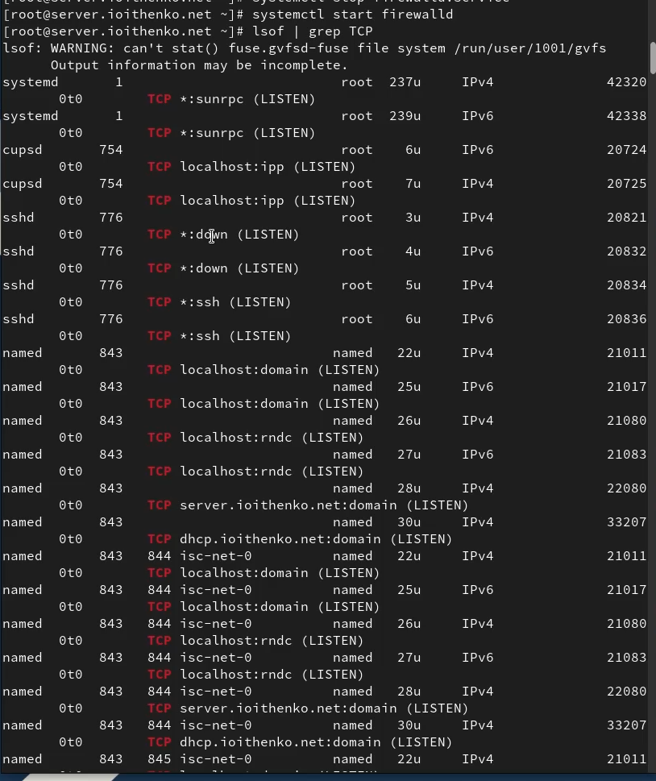

---
## Front matter
lang: ru-RU
title: Лабораторная работа №13
subtitle: Администрирование сетевых подсистем
author:
  - Ищенко Ирина НПИбд-02-22
institute:
  - Российский университет дружбы народов, Москва, Россия

## i18n babel
babel-lang: russian
babel-otherlangs: english

## Formatting pdf
toc: false
toc-title: Содержание
slide_level: 2
aspectratio: 169
section-titles: true
theme: metropolis
header-includes:
 - \metroset{progressbar=frametitle,sectionpage=progressbar,numbering=fraction}
---

## Цель работы

Приобретение практических навыков настройки сервера NFS для удалённого доступа к ресурсам.

# Выполнение лабораторной работы

##

{#fig:001 width=70%}

##

{#fig:002 width=70%}

##

{#fig:003 width=70%}

##

{#fig:004 width=70%}

##

{#fig:005 width=70%}

##

{#fig:006 width=70%}

##

{#fig:007 width=70%}

##

{#fig:008 width=70%}

##

{#fig:009 width=70%}

##

{#fig:010 width=70%}

##

{#fig:011 width=70%}

##

{#fig:012 width=70%}

##

{#fig:013 width=70%}

##

{#fig:014 width=70%}

##

{#fig:015 width=70%}

##

{#fig:016 width=70%}

##

{#fig:017 width=70%}

##

{#fig:018 width=70%}

##

{#fig:019 width=70%}

##

{#fig:020 width=70%}

##

{#fig:021 width=70%}

##

{#fig:022 width=70%}

##

{#fig:023 width=70%}

##

{#fig:024 width=70%}

##

{#fig:025 width=70%}

## Выводы

В результате выполнения лабораторной работы я приобрела практические навыки настройки сервера NFS для удалённого доступа к ресурсам.