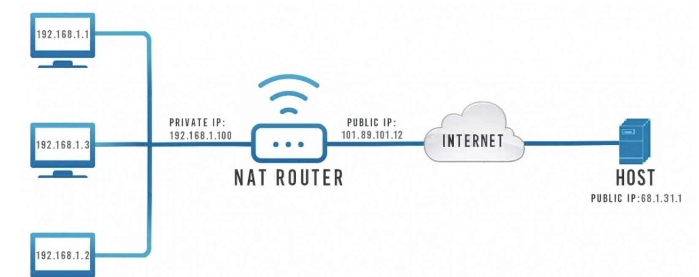
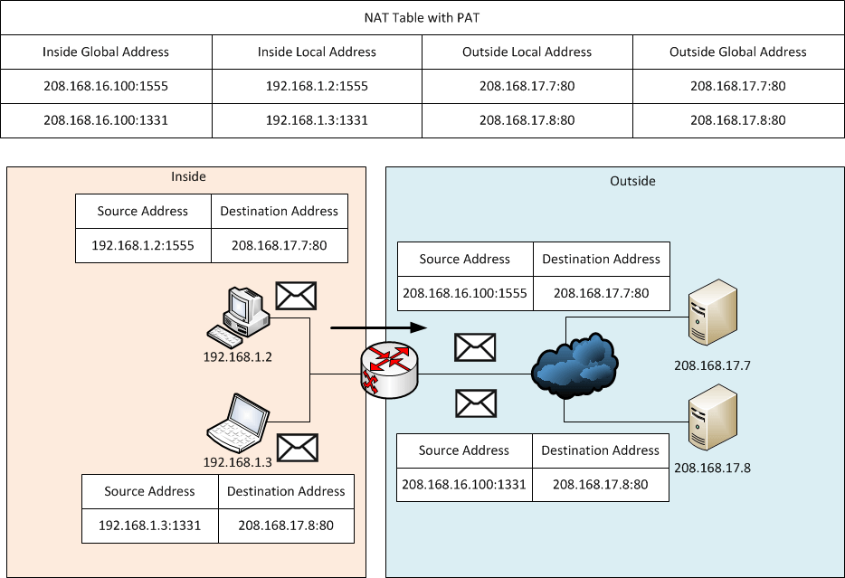

---
## Front matter
lang: ru-RU
title: Трансляция сетевых адресов (NAT)
subtitle: Администрирование сетевых подсистем
author:
  - Ищенко Ирина НПИбд-02-22
institute:
  - Российский университет дружбы народов, Москва, Россия

## i18n babel
babel-lang: russian
babel-otherlangs: english

## Formatting pdf
toc: false
toc-title: Содержание
slide_level: 2
aspectratio: 169
section-titles: true
theme: metropolis
header-includes:
 - \metroset{progressbar=frametitle,sectionpage=progressbar,numbering=fraction}
---

## Определение

NAT (Network Address Translation) — это технология, которая позволяет трансформировать IP-адреса устройств в сети, помогая экономить публичные IP-адреса и повышая уровень безопасности.

## Общий принцип

{width=100%}

## Статический NAT

: Таблица NAT

| Inside Local Address | Inside Global Address   |
|---------------------|------------------------|
| 192.168.1.2        | 208.165.17.5          |
| 192.168.1.3        | 208.165.17.6          |
| 192.168.1.4        | 208.165.17.7          |

## Динамический NAT

: Таблица NAT

| Inside Local Address | Inside Global Address   |
|---------------------|------------------------|
| 192.168.1.2        | 208.165.17.5          |
| Available           | 208.165.17.6          |
| Available           | 208.165.17.7          |
| Available           | 208.165.17.8          |

## PAT

{width=70%}

## SNAT и DNAT

`iptables -t nat -A POSTROUTING -o ens33 -j SNAT --to-source 198.51.100.1`

`iptables -t nat -A POSTROUTING -o ens33 -s 192.168.100.0/24 -j MASQUERADE`

`iptables -t nat -A PREROUTING -i ens33 -p tcp --dport 3389 -j DNAT --to-destination 192.168.100.1`

{width=50%}

## Применение

В домашних сетях NAT чаще всего реализуется через маршрутизаторы или модемы, предоставляемые интернет-провайдерами.

В корпоративных сетях NAT используется для разделения внутренней и внешней сетей, что способствует улучшению безопасности.

В облачных платформах и микросервисных архитектурах NAT играет важную роль в обеспечении безопасности и изоляции между различными компонентами системы. 

